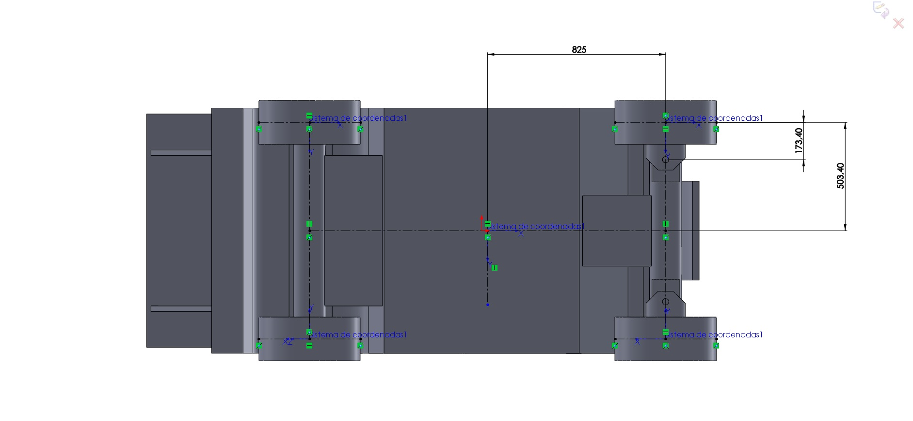

 
#### Pre requisites

-  install gazebo 9+
-  works well on ROS melodic and noetic


Install all the other required packages

```

		sudo apt-get remove ros-kinetic-gazebo* gazebo*
		sudo sh -c 'echo "deb http://packages.osrfoundation.org/gazebo/ubuntu-stable `lsb_release -cs` main" > /etc/apt/sources.list.d/gazebo-stable.list'
		wget http://packages.osrfoundation.org/gazebo.key -O - | sudo apt-key add -
		sudo apt-get update
		sudo apt-get install gazebo9 gazebo9-* ros-kinetic-gazebo9-*
		sudo apt upgrade
		sudo apt-get install libeigen3-dev ffmpeg libavcodec-dev libavformat-dev libavutil-dev libswscale-dev libyaml-cpp-dev libprotobuf-dev libprotoc-dev
		

Install dependend ROS packages 	

```
		sudo apt install ros-$ROS_DISTRO-image-view   ros-$ROS_DISTRO-joy-teleop ros-$ROS_DISTRO-nav-msgs  ros-$ROS_DISTRO-nodelet  ros-$ROS_DISTRO-urdf ros-$ROS_DISTRO-image-transport ros-$ROS_DISTRO-roslint ros-$ROS_DISTRO-angles ros-$ROS_DISTRO-cv-bridge ros-$ROS_DISTRO-tf2-geometry-msgs ros-$ROS_DISTRO-xacro ros-$ROS_DISTRO-camera-info-manager ros-$ROS_DISTRO-cmake-modules ros-$ROS_DISTRO-gazebo-msgs ros-$ROS_DISTRO-mavros-msgs ros-$ROS_DISTRO-control-toolbox  ros-$ROS_DISTRO-libmavconn ros-$ROS_DISTRO-mavros ros-$ROS_DISTRO-octomap-msgs ros-$ROS_DISTRO-geographic-msgs ros-$ROS_DISTRO-mavlink ros-$ROS_DISTRO-mavros-extras  ros-$ROS_DISTRO-joy ros-$ROS_DISTRO-effort-controllers ros-$ROS_DISTRO-velocity-controllers


```

### How to run the gazebo sim
-----------------------------------------------------

This will launch the sonoma_raceway by default .

	roslaunch rbcar_sim_bringup rbcar_complete.launch

Once Gazebo is launched succefully 
	
	roslaunch rbcar_control rbcar_control.launch	

 


To control the robot with **/cmd_vel**


	roslaunch ackermann_drive_teleop ackermann_drive_joyop.launch


To launch gmapping and move_base


	roslaunch rbcar_localization slam_gmapping.launch


To launch **move_base with TEB planner**

	roslaunch teb_local_planner_tutorials robot_carlike_in_stage.launch
	

To launch **RVIZ**

	roslaunch rbcar_viz view_robot.launch

 


## Disclaimer  , this is all from opensource projects 

 
 I find the lack of a ackerman robot with properly documented instructions on how to get it working , thus i am taking the time to do it .

Hope you find this helpful!

 
 
 
##### List of original repositories i have downloaded the code from
 --------------------------------------
  

  
- [https://github.com/RobotnikAutomation/rbcar_sim](https://github.com/RobotnikAutomation/rbcar_sim) 

- [https://github.com/RobotnikAutomation/rbcar_common](https://github.com/RobotnikAutomation/rbcar_common) 

- [https://github.com/RobotnikAutomation/robotnik_msgs](https://github.com/RobotnikAutomation/robotnik_msgs) 

- [https://github.com/RobotnikAutomation/robotnik_sensors](https://github.com/RobotnikAutomation/robotnik_sensors) 


- [https://github.com/gkouros/ackermann-drive-teleop](https://github.com/gkouros/ackermann-drive-teleop) 


